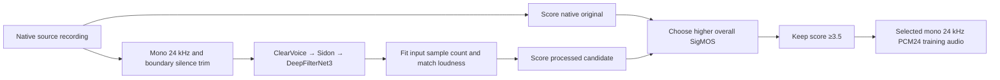

# Non-VOA quality evaluation

Run all commands from the repository root. The evaluator measures quality. It
does not reject recordings or select checkpoints. All threshold flags are
report-only. HNR is not a metric or a rejection condition in this evaluator.

For new preprocessing comparisons, use the
[MFA sweep](#active-processing-comparison-mfa-boundaries-for-every-method).
It replaces energy-based trimming for every current processing variant.
Older versioned commands and measurements below document historical runs.

## Full-corpus MFA best-method run (V12, 50K steps)

The authorized V12 run applies the best **single** MFA preprocessing method,
ClearVoice → Sidon → DeepFilterNet3 at 100% wet, to all 80,751 non-VOA items.
Its 800-item pilot median overall SigMOS was **3.16157**; 153 pilot items
scored at least 3.5. These pilot counts are not a full-corpus yield estimate.
V12 keeps train/dev recordings whose **processed** overall SigMOS is **≥3.5**.
It does not use the brute-force selector or substitute normalized originals.
The original 1,688-item evaluation split remains unfiltered; checkpoint quality
evaluation uses the existing fixed 88-item held-out panel and native recordings.

Processing steps:

1. Recover each original recording from the pinned downloads, matching its
   compressed-source SHA-256. Decode native audio, then make mono 24 kHz PCM24
   alignment input without the previous energy trim.
2. Expand the pinned Ukrainian MFA dictionary with the pinned G2P model. Align
   source- and split-specific chunks with speaker adaptation. Chunk membership
   stays fixed across resumes. Reuse frozen pilot alignments only when their
   input hash matches exactly. See [MFA licenses](../licenses/MFA.md) for MIT
   tooling and CC-BY-4.0 model attribution.
3. Cut only boundary silence, with 100 ms padding. Invalid/uncertain alignments,
   unsupported tokens, speech spans below 0.5 seconds, or proposed removal above
   50% preserve the complete untrimmed recording and receive review flags.
4. Run ClearVoice, Sidon and DeepFilterNet3 on GPU; preserve the MFA frame count.
   Match input loudness and cap sample peaks at −0.1 dBFS. Save mono 24 kHz PCM24.
5. Score that exact saved waveform with all seven SigMOS outputs on GPU. Apply
   the inclusive overall-score threshold to train/dev only. No HNR rejection.
   Persist per-item decisions, source/model/output hashes and boundary audits.
6. Prepare phonemes, features and ECAPA embeddings from the retained processed
   audio. Preserve split assignments and verify the held-out population. Train
   a fresh JETS model for exactly **50,000 optimizer iterations**, saving 25K and
   50K milestones, then evaluate both through the existing checkpoint evaluator.

Submit from the repository root (add site-specific SLURM options locally):

```bash
mkdir -p training/quality_runs
PROCESS_JOB=$(sbatch --parsable training/slurm/quality_v12_process.sbatch)
sbatch --dependency="afterok:${PROCESS_JOB}" training/slurm/quality_v12_train.sbatch
```

Downloads must already be present; `training/scripts/download_non_voa.py`
restores the pinned source files when needed. Processing uses bounded scratch
chunks and retains only passing train/dev outputs plus every held-out output.
It resumes durable decisions, checks provenance and waveform hashes, and
rebuilds only its own unfinished scratch. Models use GPU; MFA and audio I/O use
CPU with preparation overlapping enhancement. Default model concurrency is 12,
with worker recycling every 64 files and a 24 GiB available-memory reserve.

Runtime results are under `training/data/quality_v12/`: `scores.{csv,jsonl}`,
`summary.{csv,jsonl}`, `coverage.json`, `decisions/`, `alignments/`, `run.json`,
and `complete.json`. `progress.json` reports completion and a measured ETA in
`Europe/Kyiv`. An ETA appears after the first complete chunk. Scratch output,
audio, models and machine-specific paths stay ignored.

After processing completes, export portable per-item scores, all-source and
per-source distributions (including standard deviation and duration quantiles),
retained hours and Ukrainian alphabet coverage with:

```bash
training/.venv/bin/python -m training.scripts.report_quality_v12
```

This writes `training/reports/quality_v12_scores.{csv,jsonl}`,
`quality_v12_distribution.{csv,jsonl}`, and `quality_v12_summary.json`.
The distributions include both untrimmed input and processed durations for
each population, plus removed seconds and overlapping MFA review flags, so
boundary changes can be distinguished from the effect of quality filtering.

Both SLURM launchers run the supervisor at 60-second intervals, recording
process state, GPU utilization/power, memory, free disk and log activity under
`training/quality_runs/v12/`. Inspect those records and the active log at least
every 30 minutes. Training starts only after successful full processing and
dataset validation. Its input binding prevents reuse of a checkpoint with a
changed corpus/configuration; resubmitting the training job resumes only the
same V12 experiment. Checkpoints remain under `training/exp_quality_v12/`.
The preparation audit also hashes the waveforms, embedding archives,
normalization statistics and collected feature arrays, so replacing data at
an unchanged path cannot silently alter a resumed run.

W&B project **`ukrainian-tts`**, run **`quality-v12-mfa-best-ge3.5-50k`**, receives
numeric training/validation metrics only. Model, audio, code and machine metadata
uploads remain disabled. Final checkpoint evaluation includes SigMOS, Audiobox
PQ, Whisper and Parakeet CER/WER, ECAPA similarity, clipping, duration and local
high-frequency burst diagnostics, whole-file and worst-segment results, and
checkpoint comparisons. Checkpoint selection remains report-only.

Preflight validation: 18 focused tests passed, including threshold inclusivity,
held-out preservation, stable split-specific alignment chunks on resume, and
MFA boundary guards. A 32-item SLURM smoke run covered all eight sources; its
16 frozen pilot items reproduced identical processed PCM24 hashes and SigMOS
scores. The completed full-corpus run reproduced identical waveform hashes and
overall SigMOS scores for **all 800** frozen pilot items.

Full processing completed on 2026-10-02. All 80,751 recordings were scored;
75,972 received MFA boundary cuts and 4,779 retained their complete boundaries
with review flags. Before filtering, processed audio totals 103.61172 hours,
with overall SigMOS median **3.11425** and population standard deviation
**0.35369**. The decoded, untrimmed inputs total 126.38546 hours; this differs
from historical energy-trimmed corpus durations.

The ≥3.5 threshold retains **10,383 train/dev items (16.84018 hours)**:
10,187 training items and 196 development items. Their overall SigMOS median
is **3.63166**, mean **3.67003**, and population standard deviation **0.14717**.
Median retained duration is 4.73 seconds. Training transcripts cover all 33
Ukrainian letters, including 94 occurrences of ґ. The 1,688 held-out items
remain unfiltered and contribute a separate 2.09777 processed hours.

| Source | Retained train/dev items | Hours | Median overall SigMOS |
| --- | ---: | ---: | ---: |
| Common Voice | 3,885 | 4.25750 | 3.61119 |
| FLEURS | 362 | 1.12022 | 3.65154 |
| OpenTTS Lada | 92 | 0.10471 | 3.56650 |
| OpenTTS Mykyta | 592 | 0.62102 | 3.67900 |
| OpenTTS Tetiana | 566 | 0.67306 | 3.65164 |
| Telegram voices | 89 | 0.10171 | 3.62406 |
| UA SER | 32 | 0.02329 | 3.65445 |
| Ukrainian dialects | 4,765 | 9.93868 | 3.64230 |

All per-item scores and per-source distributions are exported in the portable
reports above.

Training is in progress. The first thirty completed epochs (30,000 of 50,000
steps) passed without nonfinite losses or resource alerts. At 30K, epoch-mean
training mel loss is **44.64366** and validation mel loss is **45.33163**,
compared with **66.61093** validation mel loss at 1K. The lowest validation
mel loss observed so far is **44.20304** at 23K. These are model
losses, not audio-quality MOS measurements. Paired epoch summaries are in
`training/reports/quality_v12_training_epochs.{csv,jsonl}`. Export an updated
snapshot from TensorBoard with:

```bash
training/.venv/bin/python -m training.scripts.report_training_epochs \
  --events training/exp_quality_v12/tts_jets_quality_v12_50k/tensorboard \
  --output-prefix training/reports/quality_v12_training_epochs \
  --through-step 50000
```

The exporter includes only steps with completed validation and keeps the
latest training summary at each matching step. Output contains scalar names,
steps and values, without local paths or machine metadata. At the initial
1K remote check, W&B contained numeric metrics and no model artifacts.
Final checkpoint quality measurements follow training completion.
The 25K milestone is preserved, and its SHA-256 matches the epoch-25 model.
Its portable provenance is in `training/reports/quality_v12_checkpoint_25k.json`.

Intermediate **8K, 21K, 30K, 42K and 48K checkpoint listening sets** each contain 10 generated
recordings from the fixed held-out panel, covering all eight sources. The texts
and reference hashes match across checkpoints. Each example includes
its transcript, original recording and processed reference. Selection uses seed
777 and round-robin sources, before synthesis; it does not select by output
quality. ECAPA conditioning matches the processed-reference policy used by the
checkpoint evaluator. Generated waveforms receive no enhancement or loudness
normalization. The frozen checkpoint hash is recorded in
`training/reports/quality_v12_listening_8k.json`,
`training/reports/quality_v12_listening_21k.json`,
`training/reports/quality_v12_listening_30k.json`,
`training/reports/quality_v12_listening_42k.json` and
`training/reports/quality_v12_listening_48k.json`.

Open `training/quality_runs/v12/listening_48k/preview.html` for the latest standalone page
with embedded audio, or `index.html` beside its `audio/` folder. The complete
portable package is `listening_set.zip` in the same directory. Audio and model
files remain local. To regenerate inside a SLURM allocation, provide an empty
output directory and an immutable copy/link of the selected epoch checkpoint:

```bash
source training/activate.sh
export UKTTS_ESPEAK_DATA_HASH_FILE="$PWD/training/quality_runs/v10/frontend/ESPEAK_NG_DATA_HASH"
python -m training.scripts.generate_checkpoint_listening \
  --checkpoint training/quality_runs/v12/snapshots/48k.pth \
  --config training/exp_quality_v12/tts_jets_quality_v12_50k/config.yaml \
  --manifest training/data/quality_v12/manifests/quality_v12_eval.parquet \
  --panel training/quality_runs/v10/panels/heldout.jsonl \
  --xvector training/dump_quality_v12/xvector/quality_v12_eval/xvector.scp \
  --output training/quality_runs/v12/listening_48k --step 48000 --count 10
```

Validation checked all 30 waveform hashes and finite/nonzero audio, all audio
references in both HTML pages (including embedded bytes), and ZIP integrity.

Full-run throughput tuning on 2026-10-02 compared consecutive Common Voice
chunks of 2,048 files. Times include enhancement, SigMOS scoring and durable
decisions, with the next chunk's MFA work overlapped. Audio seconds per second
accounts for varying recording lengths; these are operational measurements on
different chunks, not a paired benchmark of identical inputs.

| Model workers | Files per worker lifetime | Measured chunks | Audio seconds / wall second |
| --- | --- | --- | --- |
| **12 (selected)** | **64** | **5** | **16.0309** |
| 16 | 32 | 1 | 14.7552 |
| 16 | 64 | 1 | 15.5564 |

The higher-concurrency settings did not improve observed throughput. The run
returned to 12 workers with 64-file lifetimes, preserving all 14,336 completed
decisions across these trials. Inputs, processing method, seeds and score
threshold were unchanged. Per-chunk timings and audio totals are stored in
`training/reports/quality_v12_processing_throughput.{csv,jsonl}`.

## Fixed data

Download the eight sources at the revisions already recorded in this branch:

```bash
python training/scripts/download_non_voa.py
```

This restores the original CV22 source used by the earlier local copy. It does
not download VOA. Download state is in
`training/data/non_voa_downloads/downloads.json`. Reconstructed counts can
differ from the previous host. Record measured counts before training.

Freeze two panels from a canonical, unenhanced manifest with existing splits:

```bash
python -m training.quality select --manifest /path/to/all.parquet \
  --output training/quality_runs/v10/panels --per-source 100 \
  --downloads training/data/non_voa_downloads/downloads.json
```

The processing panel uses the training split. The checkpoint panel uses only
the evaluation/test split. Each panel takes the same number from each available
source, capped at 100 and at the smallest eligible source. Sorting uses a fixed
hash seed. Held-out items sharing normalized text or audio bytes with train/dev
are excluded. The files, transcripts, split, original audio hashes, source
counts, and panel hashes are frozen. Existing panels cannot be overwritten.
Keep the complete held-out split out of training; a panel is a measurement
subset, not a new training split. This is utterance/text holdout, not a claim
that speakers are unseen.

For this downloaded corpus, `--downloads` recovers the selected original
recordings at their native sample rate, channel count, and untrimmed boundaries
as float WAV references. The panel separately binds canonical 24 kHz processing
inputs by hash. Thus original/checkpoint comparisons include effects of boundary
trimming and resampling, and the identity processor measures that base conversion.
For an external manifest without the download registry, omit `--downloads`;
its existing audio files become the references, as recorded in `selection.json`.

## Metrics

The same evaluator handles processing outputs and synthesized checkpoint WAVs:

- [Microsoft SigMOS](https://github.com/microsoft/SIG-Challenge/tree/main/ICASSP2024/sigmos):
  overall, speech, noise, coloration, discontinuity, plus loudness and reverb.
- [Meta Audiobox Aesthetics](https://github.com/facebookresearch/audiobox-aesthetics):
  production quality (PQ).
- [Whisper](https://github.com/openai/whisper): Ukrainian transcription with
  fixed language and decoding settings. CER/WER compare against the supplied
  source transcript. Normalization uses NFC, lowercase, standardized apostrophes,
  punctuation/whitespace cleanup, and removal of stress marks. Digits are kept;
  there is no number verbalizer. CER excludes spaces. Corpus error rates use
  total edits divided by total reference characters/words.
- [NVIDIA Parakeet TDT 0.6B v3](https://huggingface.co/nvidia/parakeet-tdt-0.6b-v3):
  an additional multilingual ASR check supporting Ukrainian, with automatic
  language detection and the pinned checkpoint's default decoding. Audio is
  resampled to 16 kHz mono. `parakeet_text`, `parakeet_cer`, `parakeet_wer`, and
  edit/reference counts are saved separately; `cer`/`wer` remain Whisper scores.
  Both ASR systems use identical transcript normalization. Per-source,
  source-macro, corpus-weighted rates, and checkpoint deltas include Parakeet.
  Missing reference text has no CER/WER and contributes no corpus edits.
  ASR errors measure intelligibility and recognizer behavior, not acoustic MOS.
- [SpeechBrain ECAPA](https://huggingface.co/speechbrain/spkrec-ecapa-voxceleb):
  cosine similarity to the original recording. This is speaker preservation,
  not proof of speaker identity.
- Signal diagnostics: clipping, relative duration changes, and local bursts
  above 6 kHz. The burst diagnostic combines spectral energy fraction, excess
  above a local median, and a signal floor. It is a heuristic; fricatives can
  trigger it. It is unavailable when the sample rate has no band above 6 kHz.

All learned quality scores and ECAPA similarity are also calculated on
overlapping 3-second windows, including the file tail. Each file lists its
worst three windows for each metric. Local times are relative to the candidate
audio. Windows from synthesized and original speech are not time-aligned.
Segment CER/WER is deliberately unavailable without time-aligned reference text;
the whole transcript must not be compared to a short crop. Short windows and
all uncalibrated thresholds need human review.
CER/WER also depend on the accuracy of the supplied source transcripts.

## Run evaluation and comparisons

Set local model paths in `training/conf/quality.yaml`. Use the same configuration
and model versions for every result in a comparison. First score originals:

```bash
python -m training.quality evaluate \
  --panel training/quality_runs/v10/panels/heldout.jsonl \
  --label original --output training/quality_runs/v10/original --resume
```

Score a checkpoint's decoded WAVs (`<utterance_id>.wav`):

```bash
python -m training.quality evaluate \
  --panel training/quality_runs/v10/panels/heldout.jsonl \
  --wav-dir /path/to/decoded/wav --allow-extra-wavs \
  --checkpoint /path/to/25k.pth --training-config /path/to/config.yaml \
  --label 25k --output training/quality_runs/v10/25k --resume
python -m training.quality compare \
  --candidate training/quality_runs/v10/25k \
  --original training/quality_runs/v10/original \
  --previous /path/to/previous_quality --best /path/to/reviewed_best_quality \
  --output training/quality_runs/v10/25k
```

For the first checkpoint omit `--previous` and `--best` if no prior model exists.
The best baseline is supplied explicitly after review. No metric automatically
promotes a checkpoint. Comparison requires identical panel/config/model
provenance, complete coverage, and unchanged reference hashes. Missing model
dependencies or inference failures produce an incomplete result, not a proxy
score. Resume caches include audio, model, configuration, and checkpoint hashes.

Each result directory contains `per_file`, `segments`, `aggregate`, and `errors`
in both JSONL and CSV, plus `run.json` and resumable per-file caches. Comparisons
produce `comparison_per_file` and `comparison_aggregate` in JSONL/CSV.
Aggregates include per-source statistics and equally weighted source means,
alongside pooled statistics. All deltas are candidate minus baseline. Higher
quality/ECAPA is better; lower CER/WER/clipping/burst count is better. Duration
ratio is diagnostic and should be near one.

## Existing milestone integration

Every existing milestone script that invokes `synthesize_eval.py` can enable
quality evaluation through these environment variables (use absolute paths):

```bash
export UKTTS_QUALITY_PANEL="$PWD/training/quality_runs/v10/panels/heldout.jsonl"
export UKTTS_QUALITY_CONFIG="$PWD/training/conf/quality.yaml"
export UKTTS_QUALITY_ORIGINAL="$PWD/training/quality_runs/v10/original"
export UKTTS_QUALITY_PREVIOUS=/absolute/path/to/previous_quality
export UKTTS_QUALITY_BEST=/absolute/path/to/reviewed_best_quality
```

The same values can be passed as `--quality-*` arguments to
`training/scripts/synthesize_eval.py`. Quality output is saved beside the
existing structural evaluation report, with `_quality` appended. Structural
errors stop scoring. Threshold flags do not fail the checkpoint. Silent but
nonempty WAVs and unusual durations are warnings and still reach the quality
evaluator. The synthesis report's absolute duration warning bounds default to
0.1–30 seconds and can be changed with `--duration-warning-min` and
`--duration-warning-max`. Relative duration-change flags use the quality YAML.
Empty files, nonfinite samples, wrong audio format, and missing IDs remain
structural errors.

## Validation

```bash
python -m pytest -c training/pytest.ini training/tests/test_quality.py -q
```

These tests use synthetic signals and explicit test doubles. They validate
data isolation, diagnostics, output formats, coverage, cache invalidation, and
paired comparisons. They are not evidence of learned-model accuracy or of a
completed real audio experiment.

## Environment and SLURM execution

Install PyTorch/torchaudio 2.9.1 from the CUDA wheel index compatible with the
allocated GPU. The training bootstrap accepts `TORCH_INDEX_URL`; it preserves
SLURM's `CUDA_VISIBLE_DEVICES`. ARM builds of DeepFilterNet need Cargo/Rust.
Then run `bash training/scripts/bootstrap_quality.sh`. SigMOS code is pinned
to a commit, its ONNX model is checked against its Git LFS SHA-256, and the
Audiobox checkpoint hash is recorded. Whisper and ECAPA identities are saved
in each evaluation. The FFmpeg executable is local to the environment.

SigMOS uses the ONNX Runtime GPU distribution. The bootstrap removes the CPU
distribution because both share the same Python namespace. Runtime profiling
checks that neural operations run on CUDA; integer tensor-shape bookkeeping may
run on CPU. Its placement counts are recorded in model provenance. Whisper,
Audiobox, ECAPA, and Parakeet also verify GPU tensor placement. CUDA installation
or model-placement failures stop the job rather than producing CPU model scores.

Install the isolated, pinned NeMo environment for Parakeet as well:

```bash
bash training/scripts/bootstrap_nemo_env.sh
```

It accepts the same `TORCH_INDEX_URL` override. The quality configuration pins
Parakeet's model revision and names its Python executable and cache. Evaluation
downloads that revision if absent, records the checkpoint hash and NeMo source
revision, and invokes one batched NeMo worker per panel. Per-file transcription
caches bind model identity to audio bytes. A failed worker fails evaluation;
there is no silent fallback to Whisper. Existing reports without Parakeet must
be regenerated in a new result directory before comparison with enabled runs.

The enhancement adapters additionally need ClearerVoice, Transformers, and
DeepFilterNet. With Cargo/Rust on `PATH`, run
`bash training/scripts/bootstrap_quality_processing.sh` after the quality
bootstrap. It accepts `TORCH_INDEX_URL` and records processor identities per
processed file. Run a small processing sweep to verify actual inference before
the full experiment; successful imports alone do not validate model execution.

Reconstruct the downloaded corpus without a denoiser:

```bash
python3 -m venv training/.venv-data
training/.venv-data/bin/pip install -r training/requirements-data.in
DATA_PYTHON="$PWD/training/.venv-data/bin/python"
OPENBLAS_NUM_THREADS=1 OMP_NUM_THREADS=1 "$DATA_PYTHON" -m training.scripts.materialize_non_voa --workers 8
"$DATA_PYTHON" -m training.quality select --manifest training/data/quality_v10_raw/all.parquet \
  --output training/quality_runs/v10/panels --per-source 100 \
  --downloads training/data/non_voa_downloads/downloads.json
```

The reconstruction preserves native decoded audio until the 24 kHz conversion,
uses the existing boundary-trim algorithm, and writes PCM24. It removes exact
audio and normalized-text duplicates and uses fixed global text groups for
96/2/2 train/dev/eval splits. These are newly reconstructed splits, not a claim
to reproduce the old host's manifest. Downloaded originals remain preserved.
Conversion uses separate worker processes, with one decoder thread per file.
Verified per-file caches survive interruption; rerunning the command reconstructs
the complete manifest with the same deduplication and split policy.
The recorded corpus uses PyAV 19.0.0 and SoundFile 0.14.0 in the isolated CPU
decoder environment; the scoring environment has separate dependency pins.
See [decoder environment](../reports/quality_v10_decoder_environment.json) for
library versions and implementation hashes. Preserve the frozen audio hashes
for comparisons. If changing decoder versions, reconstruct into a fresh output
directory instead of mixing new outputs with existing per-file caches.

Submit GPU work from the repository root (the default SLURM partition is used):

```bash
mkdir -p training/quality_runs
sbatch training/slurm/quality.sbatch python -m training.quality.search \
  --panel training/quality_runs/v10/panels/processing.jsonl \
  --output training/quality_runs/v10/search
```

The search compares a base-conversion control, individual GPU processors, and
GPU model cascades. It also tests a 50 percent dry mix. Loaded tensor devices,
including frozen TorchScript weight constants, are checked and recorded.
GPU-capable neural stages must stay on GPU. The bundled RNNoise executable
runs on CPU and is permitted, as are CPU decoding, resampling, loudness
matching, and non-model signal filters.
CPU loudness matching and WAV writes overlap GPU inference through a bounded
worker queue (`process --cpu-workers`, default 4). Model calls stay sequential
to preserve recurrent state, and worker failures propagate to the pipeline.
`--model-workers` can run independent model processes on disjoint input shards.
Each process owns its model state and exits after a bounded chunk (default
64 files, `--chunk-size`) to release retained native allocations. Unused host
allocations are also released every eight completed files. Chunks have separate
progress and result files; the parent audits complete coverage before merging
the report. `--minimum-available-gib` stops processing before the configured
available-memory reserve is exhausted. Benchmark worker
counts and verify output identity before increasing concurrency. Preparation
accepts `PROCESS_MODEL_WORKERS`, `PROCESS_CPU_WORKERS`, and
`PROCESS_CPU_THREADS` (defaults 1, 2, and 1), plus `PROCESS_CHUNK_SIZE`
and `PROCESS_MIN_AVAILABLE_GIB` (defaults 64 and 4).
If an input or enhanced signal falls below the EBU loudness measurement gate,
normalization applies only the peak cap and records `below_measurement_gate`.
The file remains in the evaluation, exposing suppression in the content and
quality metrics; an undefined loudness measurement never causes an unlimited gain.
An optional profile field, `input_peak_dbfs: -3`, peak-normalizes the model input.
The processor reverses that input gain before wet/dry blending and final loudness
matching. This is an experimental processing setting and must be compared on the
fixed panel before use; it is disabled by default.
Profiles can also set `output_lufs: -23` to test a common final loudness target
instead of matching each input recording. This remains linear gain with a peak
cap; the report records when the peak cap prevents reaching the target. The
option also supports `backend: identity` to isolate level normalization from
model effects. Without this field, final loudness matches the original input.

For faster local refinements, freeze a smaller source-balanced subset of the
processing panel and derive its reference scores from completed measurements:

```bash
python -m training.quality.refine_panel \
  --parent training/quality_runs/v10/panels/processing.jsonl \
  --output training/quality_runs/v10/refinement --per-source 20 \
  --reports training/quality_runs/v10/search/original \
    training/quality_runs/v10/search/identity_wet1/quality
```

This selects training items only, verifies measured audio hashes, and recomputes
aggregates from the selected per-file and segment scores. Derived reports record
their parent provenance and do not pretend the models were rerun. Evaluate new
profiles with `refinement/processing.jsonl`, compare with `refinement/references`,
then confirm promising settings on the full 800-item processing panel before
selection. The held-out checkpoint panel remains unchanged.
To evaluate the complete historical v8/v9 training recipe, including its DSP,
RNNoise85, and production fallbacks for outputs below the loudness gate:

```bash
sbatch training/slurm/quality.sbatch bash training/scripts/evaluate_legacy_quality.sh
```

The default uses the fixed 160-item refinement panel and matching references.
ClearVoice, Sidon, and DeepFilterNet run on GPU; RNNoise runs on CPU. Two
processing workers share the allocation. The launcher checks frozen audio hashes
and the RNNoise archive checksum, records code/binary hashes and model devices,
and preserves the previous recipe's fallback behavior. This reproduces the
historical processing recipe in the current environment, without claiming
byte identity with files produced by an earlier environment.

For the complete 800-item comparison, set all panel and reference paths together:

```bash
PANEL=training/quality_runs/v10/panels/processing.jsonl \
OUTPUT_DIR=training/quality_runs/v10/search/legacy_v8_exact \
ORIGINAL_REPORT=training/quality_runs/v10/search/original \
CONTROL_REPORT=training/quality_runs/v10/search/identity_wet1/quality \
sbatch training/slurm/quality.sbatch bash training/scripts/evaluate_legacy_quality.sh
```

`PROCESS_WORKERS` sets concurrency (default 2); `QUALITY_CONFIG` selects the
frozen metric configuration. Historical reports use the same per-file, segment,
aggregate, and comparison formats as the other profiles. The generic three-model
cascade does not include all these historical stages and is a separate trial.

The sweep also accepts `--profile-workers 2` to run independent processing and
scoring trials concurrently within one GPU allocation. Each trial writes to its
own directory and `command.log`. Compare throughput, power, and free unified
memory before increasing concurrency; the default remains one trial.
`combinations.jsonl/.csv` records the measured metric vector for each profile.
`search_report.json` lists non-dominated profiles. It does not select one.
Extend the sweep around the best reviewed combinations (for example with
`--wet 0.25 0.75`) and repeat until the tested refinements show no meaningful
improvement. Review the per-source and worst-window results as well as the mean.
Record the tested search space and the stopping decision. Finishing one finite
sweep is not proof of a global optimum. Keep checkpoint holdout out of this
processing search.

After reviewing and freezing a profile:

```bash
export PROFILE="$PWD/training/conf/quality_v10_processing.yaml"
export PROCESS_MODEL_WORKERS=8 PROCESS_CPU_WORKERS=2 PROCESS_CPU_THREADS=1
export PROCESS_CHUNK_SIZE=64
sbatch training/slurm/quality.sbatch bash training/scripts/prepare_quality_v10.sh
# After preparation succeeds:
sbatch training/slurm/quality.sbatch python -m training.scripts.calibrate_quality_v10
# After calibration succeeds, consume its measured recommendation:
CALIBRATION_FILE="$PWD/training/quality_runs/v10/calibration/recommended.json" \
sbatch training/slurm/train_quality_v10.sbatch
```

If audio processing completed but a later preparation stage failed, resubmit
the preparation command with `SKIP_AUDIO_PROCESSING=true`. This skips loading
the enhancement models again; the manifest builder still verifies every input
and output hash, PCM24 format, and frozen processing profile before proceeding.
It preserves Parquet array fields in JSONL and publishes the manifest atomically.
Reattach pending SLURM dependencies to the replacement preparation job.

`CALIBRATION_FILE` overrides `BATCH_BINS`, `WORKERS`, and `USE_TF32` with
validated values from the completed calibration. Without it, those environment
variables or the script defaults apply. Calibration trials ignore an inherited
recommendation so each declared setting is actually measured. SLURM
`afterok` dependencies can chain these jobs after the profile review.
Calibration tries real JETS training batches, worker counts, and TF32 settings,
and records runtime, power, and available unified memory. Preparation caches
pitch and energy so training can avoid repeated CPU extraction. A trial qualifies
only if both GAN optimizers completed the requested updates and model weights
are finite. Training time comes from the checkpoint reporter, excluding setup and validation from the
throughput comparison. It uses batch-bin throughput, with power as a tie
breaker, and a 100 W reference. It does not change the hardware power limit.
Unified CPU/GPU memory is one budget; do not add nominal host RAM and VRAM.
The training runner applies the same `OMP_NUM_THREADS` limit to OpenMP, MKL,
and OpenBLAS in calibration and full training; the default is four.

Calibration defaults to a 24 GiB available-memory reserve, configurable with
`--minimum-available-gib`. Its supervisor checks memory every second independently
of GPU telemetry and terminates the trial's process group if the reserve is
breached, escalating after two seconds to clean up descendants. A stopped trial
cannot become the recommendation. Full training uses the same guard, configured
by `TRAIN_MIN_AVAILABLE_GIB` (default 24). The actual training log also counts as
activity, avoiding false stall alerts when the launcher itself is quiet.

To refine a completed calibration without repeating successful trials, use a
new `--output` directory and pass `--prior-trials` with an earlier `trials.jsonl`.
Only trials with verified updates in both optimizers and sufficient memory
qualify. `combined_trials.jsonl/.csv` retains the old and new measurements used
for the recommendation. Point `CALIBRATION_FILE` at that new recommendation.

Calibration now defaults to 1,000 updates per trial and releases unused CUDA
cache every 10 updates. Use `--steps` and `--cuda-cache-interval` to override
those measurements explicitly. Prior trials must match both settings; a short
trial or an earlier cache policy cannot silently become the new recommendation.

Short calibration trials do not establish long-run memory stability. The first
full run exhausted its reserve after the last logged 330 updates despite passing
100-update calibration. `UKTTS_CUDA_CACHE_INTERVAL` releases unused PyTorch
allocator blocks between complete GAN updates (default 10 in the V10 launcher;
zero disables it). Each
release logs live, reserved, and peak GPU memory before and after; it does not
discard live tensors. Calibration records this setting and carries it into the
recommendation so full training uses the measured configuration. Validate it
over at least a full training epoch before treating it as a sustained-memory
result. The independent available-memory guard remains enabled. The 50-update
policy subsequently crossed the reserve during epoch six. The active recovery
uses `UKTTS_CUDA_CACHE_INTERVAL=10` with `CALIBRATION_FILE` unset, preserving
four million batch bins and eight workers. It completed the recovery epoch
from 5K to a verified 6K checkpoint; monitoring continues because a successful
epoch does not guarantee later memory stability.

On resume, the bootstrap also restores CPU scalar step counters for ordinary
Adam/AdamW. ESPnet loads checkpoint tensors onto CUDA, but PyTorch deliberately
keeps those counters on CPU when neither `capturable` nor `fused` is enabled.
Keeping them on CUDA adds synchronization during each optimizer update. The
patch changes counter placement only; moment tensors remain on the parameter
device, and capturable/fused modes retain their CUDA counters. A GPU integration
test verifies resumed updates against uninterrupted updates. Run it inside a
SLURM allocation with `UKTTS_TEST_GPU=1 python -m pytest -q
training/tests/test_optimizer_state.py`. Normal CPU test runs skip that explicit
GPU integration case.

The environment bootstrap disables cuDNN benchmarking in the parallel speaker
extractor: variable audio lengths otherwise trigger repeated kernel searches.
The batch size remains eight. An isolated 160-file comparison verified the speed
change and near-identical vectors; see
[embedding measurements](../reports/quality_v10_embedding_benchmark.json).

The default run starts from random weights and trains 100,000 steps. The
preparation uses new statistics/tokens and recomputes the established 50/50
raw/processed speaker embeddings. `INIT_CHECKPOINT` is optional and must be
compatible with the new tokens/architecture. Every 1,000-step epoch is a
checkpoint boundary. Milestones at 25K/50K/75K/100K are preserved, audited, and
evaluated after training. Set `UKTTS_QUALITY_BEST` to an explicitly reviewed
quality result directory to include the best baseline; previous checkpoints
are chained automatically. No quality threshold can promote or reject them.

Each submitted command has a durable command log, 5-second quality-job telemetry
(60 seconds for training), a current
status JSON, and a completion summary under the ignored run directory. Check
`squeue`, the command log, status, and progress at least every 30 minutes while
the pipeline is running. A failed command exits nonzero. Resume only the same
run with unchanged provenance; correct the failure before resubmission.

For a rebuilt eSpeak runtime, `verify_local_frontend.py` checks all 550 committed
regression cases before accepting a local data hash. V10 scripts use that
ignored, verified pin. The global historical pin is not overwritten. A new
hash never permits different phonemes through this verification step.

To summarize the original-audio score distributions without rerunning models:

```bash
python training/scripts/report_source_quality_distribution.py \
  --input training/quality_runs/v10/search/original/per_file.jsonl \
  --output-prefix training/reports/quality_v10_source_mos_distribution
```

This writes whole-file percentiles by source and across the sample to CSV/JSONL,
histogram bins to separate CSV/JSONL files, and cumulative distribution plots to
PNG/PDF. The V10 baseline contains 800 recordings, exactly 100 per source. Its
pooled distribution weights sources equally, rather than by their full-corpus
proportions. SigMOS scores use 1–5 and Audiobox PQ uses 1–10; higher is better.
These are model estimates and descriptive summaries, not calibrated rejection
thresholds.

To plot median overall SigMOS across the 16 full-panel preprocessing variants:

```bash
python training/scripts/plot_processing_sigmos.py \
  --input training/reports/quality_v10_processing.csv \
  --selection training/reports/quality_v10_best_of_original_and_cascade_selection.csv \
  --output-prefix training/reports/quality_v10_processing_median_sigmos
```

This writes a ranked dot plot to PNG/PDF and its values to CSV. The 16 processing
variants and the per-item best policy cover the same 800 recordings. A separate,
explicitly labeled ≥3.5-filtered policy row covers 267 retained recordings.
The original baseline is marked, and both policy rows are highlighted. The
earlier V10 training recipe and V11 full cascade are labeled separately. The
smaller refinement panels are excluded. These are historical pilot scores;
the filtered median describes a different population. The chart uses
a zoomed score axis and reports medians, rather than means or paired changes.

To compare the original and highest-median method as matched histograms:

```bash
python training/scripts/plot_original_vs_cascade.py \
  --original training/quality_runs/v10/search/original/per_file.jsonl \
  --processed training/quality_runs/v10/search/clearervoice_sidon_deepfilternet3_wet1/quality/per_file.jsonl \
  --output-prefix training/reports/quality_v10_original_vs_cascade
```

This checks identical 800-item coverage and writes PNG/PDF with shared axes and
0.2-point bins, plus summary and histogram CSV/JSONL. Threshold counts use exact
per-file scores, independently of histogram bins. Only aggregate values are
exported; private paths and transcripts are omitted.

For a hypothetical per-item selection that uses the cascade only when its
overall SigMOS exceeds the original, add `--keep-original-if-worse` and use
`--output-prefix training/reports/quality_v10_best_of_original_and_cascade`.
This plots `max(original, processed)` after matching recording identifiers;
ties retain original audio. Additional `_selection.csv`/`_selection.jsonl`
files contain opaque sample identifiers, both scores, the chosen score, and
the chosen variant. This report does not modify audio, manifests, or training.
The selection is evaluated using the same score that drives the choice, so its
non-decreasing SigMOS is guaranteed by construction, not independent validation.

To visualize individual original-to-cascade changes:

```bash
python training/scripts/plot_individual_sigmos_changes.py \
  --original training/quality_runs/v10/search/original/per_file.jsonl \
  --processed training/quality_runs/v10/search/clearervoice_sidon_deepfilternet3_wet1/quality/per_file.jsonl \
  --output-prefix training/reports/quality_v10_individual_sigmos_changes
```

The PNG/PDF pairs a before/after scatter plot with individual changes by source.
CSV/JSONL exports contain opaque sample identifiers, sources, scores, and signed
changes; separate summaries report per-source and pooled statistics. Matching
uses original utterance/source keys before anonymizing the exported identifiers.
Positive and negative counts use any nonzero difference, not a calibrated
meaningful-change threshold. Median individual change differs from the
difference between the two groups' medians.

## V11: user-selected corpus and 50K training

V11 applies the full ClearVoice → Sidon → DeepFilterNet3 cascade, compares each
output's overall SigMOS with its native original, and chooses the processed
version only when its score is strictly higher. Ties keep the original. The
chosen score must be at least 3.5. This explicit corpus-selection policy does
not change the report-only checkpoint thresholds or introduce HNR rejection.

The audio path is:



- The processed branch starts from the existing canonical non-VOA input.
  Canonicalization uses mono 24 kHz audio, trims only leading/trailing low-RMS
  frames at 40 dB below peak frame RMS, and keeps 100 ms safety padding at each
  boundary. Frames are 1,024 samples with a 256-sample hop. Interior pauses are
  preserved. The initial corpus keeps valid, non-silent canonical clips of
  2–20 seconds, after transcript validation and deduplication.
- The cascade uses `wet: 1.0` in
  [`quality_v11_processing.yaml`](../conf/quality_v11_processing.yaml). After
  enhancement, output is cropped or zero-padded to the canonical input sample
  count. A linear gain targets that input's measured integrated LUFS, capped
  at a −0.1 dBFS sample peak. If integrated loudness is below the measurement
  gate, the documented fallback only limits peaks; it does not amplify the
  suppressed signal. CPU loudness measurement and file I/O accompany CUDA
  model inference.
- Inside the cascade, ClearVoice uses `MossFormer2_SE_48K` on audio resampled
  to 48 kHz. Sidon scales its input peak to 0.9, applies a 50 Hz high-pass filter,
  resamples to 16 kHz for feature extraction, and synthesizes 48 kHz output.
  Its adapter adds 1.5 seconds of tail padding, uses 10 ms padding at chunk
  boundaries, removes the decoder's final 20 ms per chunk, then crops to the
  intended duration. DeepFilterNet3 runs at 48 kHz with padding enabled,
  post-filter disabled, and no attenuation limit. Output returns to 24 kHz.
  Intermediate stages do not perform LUFS matching; final output matching is
  the separate step described above.
- The competing original is decoded from pinned source bytes with its native
  timing. SigMOS uses its mono signal at the native input rate through the
  official scorer. When this version wins, only channel count, sample rate,
  and PCM encoding are converted for training; the boundary trim is not used.
- Thus, a duration reduction relative to a native original comes from selecting
  the branch with the pre-existing boundary trim. The enhancement output itself
  has exactly the canonical input duration. Original winners retain native
  timing, subject only to sample-rate rounding.

```bash
sbatch training/slurm/quality_v11.sbatch
```

The pipeline streams the existing pinned non-VOA downloads, processes bounded
chunks on CUDA, scores both versions with the official CUDA SigMOS model, and
stores only retained audio plus all decisions under `training/data/quality_v11`.
It checks input/output hashes and code/profile provenance on resume. Interrupted
chunks can be regenerated; completed, hash-verified decisions are reused.
`PROCESS_MODEL_WORKERS` and `PROCESS_CHUNK_SIZE` control throughput and memory.
Temporary chunk files are removed after their decisions are saved. Existing
V10 artifacts are preserved.

The V11 processing profile pins a per-recording random seed for ClearVoice's
Kaldi feature dither and disables the profiled TorchScript optimization that
changed Sidon numerics after its first call. These settings make the new
outputs repeatable; the earlier unseeded sweep remains historical evidence,
not a cache of scores to reuse for newly generated audio.

Original winners retain native timing and are converted to mono 24 kHz PCM24
for the model. Their rendered audio is scored again and any drop below 3.5 is
reported separately; selection uses the measured native-original/cascade
comparison. The pipeline exports actual retained counts, hours, source and
split summaries, and Ukrainian letter coverage.

Train/dev assignments remain disjoint and are filtered. The complete original
evaluation split remains fixed, including the existing 88-recording quality
panel, so evaluation is not restricted to high-scoring recordings. The
`records.jsonl` file describes all passing recordings; `training_records.jsonl`
contains filtered train/dev plus that fixed evaluation population.

Preparation rebuilds manifests, ECAPA embeddings, pitch/energy and feature
statistics. Training starts from scratch in `exp_quality_v11/tts_jets_quality_v11_50k`
for 50,000 updates with 4M batch bins, 8 loader workers, FP32, and unused-CUDA-cache
release every 10 GAN updates. A separate one-second memory guard enforces a
24 GiB available-memory reserve. Durable telemetry is sampled every minute.
The 25K and 50K weights are preserved, the final optimizer counters/weights are
audited, and both checkpoints receive the existing held-out audio evaluation
(SigMOS, Audiobox PQ, Whisper/Parakeet, ECAPA, signal and worst-segment reports).

Monitor `data/quality_v11/progress.json`, `quality_runs/v11/pipeline/status.json`,
and `quality_runs/v11/training/status.json`. Selection progress includes an ETA
in Europe/Kyiv time once completed chunks provide a throughput estimate. Check
the SLURM job and logs at least every 30 minutes throughout the run.

## Listen to the per-item selection + ≥3.5 pilot

Generate a browser listening set from the exact files scored in the completed
800-recording pilot:

```bash
python training/scripts/build_selected_audio_listening.py \
  --original training/quality_runs/v10/search/original/per_file.jsonl \
  --processed training/quality_runs/v10/search/clearervoice_sidon_deepfilternet3_wet1/quality/per_file.jsonl \
  --output training/quality_runs/v11/listening_selected_pilot
```

Open `preview.html` in a browser for 32 embedded clips, four per source spread
across the retained score range. It is self-contained and works offline. Open
`index.html` for all 267 retained clips, or extract `listening_set.zip` and open
its `index.html`. Keep the extracted `audio` directory beside that page.
Source/version filters, transcripts, both scores, and the selected version are
shown. Each player contains only the chosen audio. The set contains 144 processed
winners and 123 original winners; selected median SigMOS is 3.708.

The builder checks each file against the checksum recorded during evaluation
and copies it without conversion. This listening set matches the historical
pilot chart; full-corpus V11 selection is a separate run. Generated
pages, audio, transcripts, and archives remain under the ignored runtime tree.

The V11 run was subsequently stopped at the user's request and its generated
audio, embedded preview, and listening archive were deleted. The command above
is a reproduction procedure; those generated listening artifacts are no longer
present. Source recordings and historical V10 evaluations remain available.

## Normalized original and revised selector

The normalized-original category uses the same frozen 800-recording panel
(100 per non-VOA source) and canonical inputs as the enhancement comparison:

1. Decode to mono and resample to 24 kHz.
2. Trim boundary silence with the existing 40 dB relative threshold,
   1,024-sample frame, 256-sample hop, and 100 ms padding; preserve interior pauses.
   Reuse the frozen canonical files, so trimming is not applied twice.
3. Skip the three model stages: ClearVoice, Sidon, and DeepFilterNet3
   (steps 4, 5, and 6 of the previous pipeline).
4. Preserve the canonical sample count. Match each canonical input's own
   integrated LUFS using linear gain, capped at −0.1 dBFS sample peak, and save
   mono 24 kHz PCM24. Below the loudness measurement gate, use the existing
   peak-only fallback. This is input-loudness matching, **not a common LUFS
   target**. An unchanged input generally receives unity gain.
5. Score the final saved files with all seven official SigMOS outputs on CUDA.
6. Compare each normalized file with its matching full-cascade file
   (ClearVoice → Sidon → DF3, 100% wet), the highest-median processing method
   in the existing comparison. Choose the cascade only if its overall SigMOS
   is strictly higher; ties choose normalized original.
7. Retain the chosen file if its overall SigMOS is **≥3.5**. Copy it unchanged;
   do not resample, trim, or normalize after scoring. There is no HNR rejection.

The selector checks source/recording keys, native reference hashes, canonical
input hashes, scored audio hashes, processing metadata, format, and sample
counts. The cutoff is configurable with `--threshold`. It is the explicitly
requested dataset-selection rule, not a calibrated checkpoint rejection rule.

Run from the repository root with the existing environment, downloaded official
SigMOS model, frozen panel, and historical cascade audio/metrics available:

```bash
sbatch training/slurm/normalized_original.sbatch
```

This runs processing/selection tests, renders and scores normalized originals,
copies retained audio, exports sanitized CSV/JSONL reports, and updates the
median chart. It does not launch full-corpus processing or training. Runtime
files are under `training/quality_runs/normalized_original/`; scoring progress
includes a Kyiv ETA. The no-model rendering stage uses CPU workers; SigMOS
convolutional and recurrent inference is verified on CUDA. The historical
cascade scores are reused only after verifying the exact scored files.

To rerun only selection with a different cutoff or another matched score pair:

```bash
python -m training.scripts.select_normalized_best \
  --normalized training/quality_runs/normalized_original/per_file.jsonl \
  --processed training/quality_runs/v10/search/clearervoice_sidon_deepfilternet3_wet1/quality/per_file.jsonl \
  --output training/quality_runs/normalized_original/selection \
  --threshold 3.5 --copy-audio
```

Use a new output directory when changing the input pair or threshold. The
chart's two filtered comparisons are explicitly fixed at ≥3.5.

Completed panel results (2026-10-02):

| Category | Items | Median overall SigMOS |
| --- | ---: | ---: |
| Native original, historical comparison | 800 | 3.0142 |
| Normalized original | 800 | 2.9219 |
| Full cascade | 800 | 3.2204 |
| Best of normalized original / cascade | 800 | 3.2764 |
| Best of normalized original / cascade, ≥3.5 | 239 | 3.7005 |
| Best of native original / cascade, ≥3.5, historical | 267 | 3.7082 |

The revised selector chooses 579 cascade and 221 normalized files before
filtering. After filtering it retains 159 cascade and 80 normalized originals,
**239/800 (29.875%), totaling 0.353213 hours (21.19 minutes)**. Every source
remains represented. This source-balanced panel is not a full-corpus yield
estimate. Peak limiting changes 33 normalized files; 767 remain byte-identical
to their canonical input. The normalized median equals the earlier base
mono/24 kHz/trim median, while native-original scoring differs because it used
untrimmed native-rate recordings. Filtered medians describe smaller populations.

The updated [median chart](../reports/quality_v10_processing_median_sigmos.png)
shows all processing variants and both selection policies. The
`quality_normalized_original_per_file`, `quality_normalized_original_summary`,
and `quality_normalized_original_selection` CSV/JSONL files in
`training/reports/` contain sanitized per-file scores, all seven metric
summaries (overall and per source), and every selection decision. Raw audio,
transcripts, and local paths stay in the ignored runtime directory. The
retained exact WAV copies are in
`training/quality_runs/normalized_original/selection/audio_24k/`.

Build the listening page for this revised selection:

```bash
python training/scripts/build_selected_audio_listening.py \
  --original training/quality_runs/normalized_original/per_file.jsonl \
  --processed training/quality_runs/v10/search/clearervoice_sidon_deepfilternet3_wet1/quality/per_file.jsonl \
  --baseline normalized \
  --selection training/quality_runs/normalized_original/selection/selection.jsonl \
  --output training/quality_runs/normalized_original/listening
```

Open `preview.html` in that output directory for 32 embedded examples (four per
source), or `index.html` for all 239 retained recordings. Filter by source or
selected version: normalized original versus full cascade. Cards show the
transcript and both scores. `listening_set.zip` includes both pages and all
selected WAVs. The builder verifies every decision against the selector's
JSONL and checks the chosen audio hash before copying it without conversion.
These generated listening files remain local and ignored by Git.

Validation: 12 processing/selector tests passed under SLURM, all 800 files were
scored, all 1,600 candidate hashes and processing inputs were checked, and all
239 retained copies matched their scored hashes. The previous full-corpus run
remains stopped.

## Brute-force per-item selection across all processing variants

The chart also includes each recording's maximum overall SigMOS across all
**17 scored variants**: the 16 historical variants (including native original
and the base mono/24 kHz/trim control), plus normalized original. It selects
one existing variant per recording, not a new model cascade or an average of
variant scores. Selection ties prefer normalized original, then native original,
then alphabetically sorted processing names. The ≥3.5 cutoff is inclusive.

All 13,600 scores cover the same 800 recording/source keys and native-reference
hashes. Every variant's median is checked against the existing chart data.
This is a comparison of saved scores; audio is not reprocessed or converted.
Native-original winners retain their native timing and sample rate in this
comparison. It is a panel result, not a full-corpus selection or training run.

| Category | Items | Median overall SigMOS |
| --- | ---: | ---: |
| Brute-force best, all 17 variants | 800 | 3.449173 |
| Brute-force best + ≥3.5 | 365 | 3.761352 |

The filter retains **45.625%** of the panel, totaling **0.573473 hours
(34.41 minutes)** in the selected variants, with all eight sources represented.
That is 126 more recordings than the normalized-original/full-cascade selector.
The filtered median describes this smaller population. Since overall SigMOS
also determines the winner, a higher selected score is not independent
confirmation of perceived quality or content preservation.

Rebuild the sanitized decisions and chart from the repository root:

```bash
python -m training.scripts.report_bruteforce_sigmos
python training/scripts/plot_processing_sigmos.py \
  --input training/reports/quality_v10_processing.csv \
  --selection training/reports/quality_v10_best_of_original_and_cascade_selection.csv \
  --normalized-selection training/reports/quality_normalized_original_selection.csv \
  --brute-force-selection training/reports/quality_bruteforce_selection.csv \
  --output-prefix training/reports/quality_v10_processing_median_sigmos
```

`training/reports/quality_bruteforce_selection.csv` and `.jsonl` store all 17
scores for each opaque recording ID, the winning variant and audio hash, and
the retain/reject decision. `quality_bruteforce_summary.json` records medians,
winner/source counts, tie-breaking order, and input score-file hashes.

### Brute-force listening comparisons and improvement counts

```bash
python training/scripts/build_bruteforce_listening.py
python training/scripts/plot_processing_improvement_counts.py
```

The listening output is `training/quality_runs/brute_force/listening/`:
`index.html` contains all **365 retained recordings**, with a native-original
player and selected-version player for each item. `preview.html` embeds
**32 pairs**, four per source across the retained score range, for offline
playback. Filter by source or winning method; cards show transcripts and
original/selected overall SigMOS. These are labeled listening comparisons,
not a randomized blind test or human MOS results. Native winners play the
same audio in both players. Timing and loudness remain exactly as scored.
`listening_set.zip` packages the pages and 730 hash-verified audio copies.
Generated audio and pages stay local and ignored by Git.

The [improvement-count chart](../reports/quality_processing_improvement_counts.png)
shows three counts per method: strictly higher overall SigMOS than native
original, winner among all 800 items, and winner among the 365 retained items.
Improvement counts overlap across methods; winner counts assign each item
exactly once using the documented tie-breaking order. Equal scores are not
improvements. The native original has zero improvements against itself.

The full cascade improves SigMOS on **501/800** items, followed by Sidon 100%
on **471**, and ClearVoice → Sidon 100% on **466**. The full cascade wins
97 items overall and 46 after filtering. Native original wins 157 overall
and 82 after filtering. The base trim control wins zero ties because normalized
original has priority; this does not mean it never improves the score.

`quality_processing_improvement_counts.csv` and `.jsonl` in `training/reports/`
also include equal/worse counts and improvement counts against normalized
original. These are objective SigMOS comparisons, not listener judgments.

## Active processing comparison: MFA boundaries for every method

The active comparison uses **MFA for all processing inputs**, replacing the
energy-based boundary trimming in the historical V10/V11 experiments below.
Run it on the same fixed 800 recordings (100 from each of eight non-VOA sources):

```bash
sbatch training/slurm/mfa_processing_sweep.sbatch
```

Pass any site-specific scheduler account through `sbatch --account=...`; do not
add local scheduler details to the repository. This entry point requires the
completed MFA alignment and boundary audit described below. It does not launch
full-corpus processing or training.

`prepare_mfa_processing.py` verifies source, alignment, and reference hashes,
then crops the untrimmed mono 24 kHz PCM24 input at the audited MFA frame
boundaries **without applying gain**. All 16 profiles in
`conf/quality_mfa_sweep.yaml` consume that identical crop. The 100 ms boundary
padding and alignment safeguards are shared: 710 accepted alignments are cut;
90 flagged items retain their entire recording. There is no energy-trim
fallback and no interior-silence removal. The normalized-original profile
matches its own integrated loudness with a −0.1 dBFS peak cap; enhancement
profiles match their final mixture to the same MFA-cut input's loudness.
This is input loudness preservation, not a single global LUFS target.

The base identity control only encodes the MFA crop. Modern enhancement
profiles pin per-item seed 777 and disable the profiled TorchScript executor.
The legacy cascade retains its existing DSP and degenerate-output fallback
recipe, with MFA replacing its input trim. It is not an exact reproduction
of the old energy-trimmed waveform or its unseeded stochastic inference.

The SLURM launcher defaults to 12 bounded workers (override `PROCESS_WORKERS`)
running enhancement and SigMOS on the GPU; native DSP and
RNNoise use the CPU. The run enforces memory/disk reserves, stops on worker
failure, and emits progress, GPU power/utilization, and approximate Kyiv ETA
every minute. On resume, audio and score caches are checked against hashes.
Runtime inputs, audio, per-file processing metadata, all seven whole-file
SigMOS scores, and worker logs live under
`training/quality_runs/mfa_processing/`. This sweep recomputes **SigMOS**;
the earlier full MFA evaluation contains Audiobox, ASR, speaker and segment
diagnostics and is not relabeled as an evaluation of these new outputs.

After successful completion, publish the sanitized tables and figure:

```bash
training/.venv/bin/python -m training.scripts.report_mfa_processing
```

Outputs are `training/reports/quality_mfa_processing_*`: per-file scores,
aggregate statistics by method/source/metric, per-item selections, diagnostic
JSON, and the median overall SigMOS chart in PNG/PDF. The figure shows
**median ± population standard deviation** (`ddof=0`); SD describes variation
between recordings and is not a confidence interval for the median. Native
untrimmed audio appears only as a reference. Both selectors use MFA variants
exclusively: normalized original versus the enhancement method with the best
panel median, and brute-force maximum over all 16 MFA variants. Exact ties
prefer normalized original, then alphabetical method name. Each selector has
an inclusive ≥3.5 row with its own retained count. These selected/filtered
scores describe in-sample metric optimization, not held-out model quality;
selection remains report-only.

Historical energy-based entry points and reports below are retained for
reproducibility only. Use this MFA entry point for new processing comparisons;
do not feed the old energy-trimmed canonical WAVs to a new enhancement run.

### Completed MFA sweep results

All **16 × 800 = 12,800** processed recordings completed and received all seven
whole-file SigMOS scores. Each method has the same 800-item panel; selection
rows have the counts shown. No training or full-corpus processing was started.

[Median ± SD chart](../reports/quality_mfa_processing_median_sigmos.png) ·
[PDF](../reports/quality_mfa_processing_median_sigmos.pdf) ·
[all metrics by method and source](../reports/quality_mfa_processing_summary.csv) ·
[per-file scores](../reports/quality_mfa_processing_per_file.csv) ·
[selection decisions](../reports/quality_mfa_processing_selection.csv)

| Method | Items | Median overall SigMOS | Population SD |
|---|---:|---:|---:|
| Native original | 800 | 3.01423 | 0.55825 |
| MFA crop only | 800 | 2.90549 | 0.53897 |
| Normalized original | 800 | 2.90549 | 0.53898 |
| DF3 · 50% | 800 | 2.95398 | 0.50008 |
| DF3 · 100% | 800 | 3.07477 | 0.44824 |
| DF3 · −3 dBFS input · 100% | 800 | 3.06980 | 0.43377 |
| DF3 · −3 dBFS input · 75% | 800 | 2.99594 | 0.47209 |
| ClearVoice · 50% | 800 | 2.91382 | 0.50174 |
| ClearVoice · 75% | 800 | 2.94383 | 0.47972 |
| ClearVoice · 100% | 800 | 3.00691 | 0.45596 |
| Sidon · 50% | 800 | 3.02982 | 0.47748 |
| Sidon · 100% | 800 | 3.12138 | 0.42316 |
| ClearVoice → Sidon · 50% | 800 | 3.05390 | 0.46734 |
| ClearVoice → Sidon · 100% | 800 | 3.14003 | 0.40875 |
| ClearVoice → Sidon → DF3 · 50% | 800 | 3.06087 | 0.46933 |
| ClearVoice → Sidon → DF3 · 100% | 800 | 3.16157 | 0.40077 |
| Legacy cascade (MFA input) | 800 | 3.13916 | 0.35890 |
| Best per item: normalized / full cascade | 800 | 3.22735 | 0.40189 |
| Best per item + ≥3.5 | 206 | 3.70974 | 0.20223 |
| Brute force (all 16 MFA variants) | 800 | 3.37825 | 0.36428 |
| Brute force + ≥3.5 | 307 | 3.73888 | 0.20348 |

The best single enhancement is **ClearVoice → Sidon → DeepFilterNet3 at 100% wet**:
median **3.16157**, SD **0.40077**. Choosing it versus normalized original per
item gives median **3.22735**; the ≥3.5 filter retains **206 recordings**,
**0.298838 hours** (17.93 minutes). The cascade wins 550/800 comparisons and
normalized original wins or ties 250/800. Among retained items, the split is
117 cascade / 89 normalized original.

Brute force over all 16 MFA variants gives median **3.37825**, SD **0.36428**.
Its ≥3.5 subset contains **307 recordings**, **0.439582 hours** (26.37 minutes),
with median **3.73888**, SD **0.20348**. These are observed pilot durations,
not extrapolations to the full dataset. Native untrimmed audio is a reference
only and cannot win either selector.

All scored output hashes and shared MFA input hashes were checked. Every
processed output preserves the MFA input frame count. All 208 worker tasks
used the same SigMOS code and weights. Normalized-original audio and scores
exactly match the earlier MFA baseline for all 800 recordings. The 26 relevant
boundary, processing, provenance, and selection/statistics tests passed.

The sweep used 12 concurrent workers after a cache-preserving concurrency
adjustment. Sampled GPU utilization during the modern cascades was about
88–96%; those samples drew roughly 44–50 W. Power did not reach 100 W.
No worker failed. Native DSP/RNNoise remained on CPU; enhancement models and
SigMOS were verified on CUDA. Historical/new enhancement differences should
not be attributed solely to trimming: the new modern profiles also pin the
per-item seed and TorchScript execution mode. Historical reports are preserved.

### MFA brute-force listening page

Build paired comparisons from the exact scored files and published decisions:

```bash
training/.venv/bin/python training/scripts/build_mfa_bruteforce_listening.py
```

The output is `training/quality_runs/mfa_processing/listening/`:

- `index.html` contains all **800** pairs. Its initial ≥3.5 filter shows **307**
  recordings; choose **All scores** to hear the rest. Source and winning-method
  filters combine with the score filter.
- Each pair compares **normalized original with MFA boundaries** against the
  highest-scoring version across all **16 MFA variants**. It displays the
  Ukrainian transcript, winning method, original/selected SigMOS, score change,
  duration, and alignment-review flags. The 90 flagged alignments remain
  untrimmed in both versions. Native untrimmed audio is not a selection candidate.
- `preview.html` embeds **32 pairs**, four per source spanning the retained
  score range, for playback from a single HTML file.
- `listening_set.zip` packages both pages, the decisions/report, and **1,600**
  WAV copies. Extract it and open `index.html` for offline playback.

The builder checks every per-item maximum and exact-tie preference against the
saved scores, verifies the shared MFA input/reference hashes, and hash-checks
every copied WAV. It does not reprocess or normalize the listening audio.
These are labeled comparisons, not a blind listening test. Pages, transcripts,
audio and archives remain local and ignored by Git.

### Best single MFA method listening page

```bash
training/.venv/bin/python training/scripts/build_mfa_bruteforce_listening.py --mode best_method
```

This writes `training/quality_runs/mfa_processing/listening_best_method/`.
The builder chooses the enhancement method with the highest 800-item median
overall SigMOS: **ClearVoice → Sidon → DeepFilterNet3 at 100% wet**, median
**3.16157**. Every processed player uses this one method, including cases that
score below normalized original. It does not apply per-item fallback.

`index.html` shows all **800** paired comparisons by default, with source and
optional processed-SigMOS ≥3.5 filters (**153** recordings). `preview.html` embeds **32 pairs**, four
per source spanning the complete processed-score range. `listening_set.zip`
contains both pages, metadata, and all 1,600 hash-verified WAV copies. Both
players share the same MFA boundaries. The brute-force listening set remains
available separately.

## MFA boundary-trimming pilot (historical comparison)

The MFA experiment starts from the **800 frozen native, untrimmed recordings**,
not from already trimmed training copies. It compares transcript-guided phone
boundaries with the existing energy-based trim. It does not restart training
or change full-corpus audio.

Commercial-use licensing and attribution are recorded in
[`training/licenses/MFA.md`](../licenses/MFA.md). MFA **2.2.17** is MIT-licensed;
the Ukrainian acoustic model, dictionary, and G2P model **v2.0.0a** are published
under **CC BY 4.0**, which permits commercial use with attribution. The pinned
download URLs and hashes are in `training/conf/quality_mfa_assets.json`.

The isolated environment avoids Kalpy, which is not needed by this MFA release.
Create it with conda/micromamba using `training/conf/mfa_environment.yaml`, then
install `montreal-forced-aligner==2.2.17` using that environment's pip with
`--no-deps`. Provide SoX on `PATH` (a distribution package is suitable where a
conda build is unavailable). The launcher defaults to an environment under
`training/quality_runs/mfa_trim/tools/env`; `MFA_ENV` can override it.
Keep model/environment files in the ignored runtime tree. Use the matching
environment's SQLite executable and library together.

```bash
python -m training.scripts.download_mfa_assets
python -m training.scripts.prepare_mfa_panel
sbatch training/slurm/mfa_align.sbatch
# Once alignment succeeds:
sbatch training/slurm/mfa_evaluate.sbatch
# Once evaluation succeeds:
python -m training.scripts.report_mfa_trim
python training/scripts/build_mfa_listening.py
python training/scripts/plot_processing_sigmos.py \
  --input training/reports/quality_v10_processing.csv \
  --selection training/reports/quality_v10_best_of_original_and_cascade_selection.csv \
  --normalized-selection training/reports/quality_normalized_original_selection.csv \
  --brute-force-selection training/reports/quality_bruteforce_selection.csv \
  --mfa-metrics training/reports/quality_mfa_per_file.csv \
  --output-prefix training/reports/quality_v10_processing_median_sigmos
```

Processing order:

1. Verify each native reference hash; decode to untrimmed mono 24 kHz PCM24.
2. Normalize transcript case/apostrophes/punctuation for alignment only.
   Preserve original evaluation transcripts. Generate missing pronunciations
   using the matching G2P model and append them to a local dictionary copy.
3. Align with MFA's CPU GMM-HMM model using eight workers, beam 100, retry
   beam 400, and speaker adaptation. Export phone/word JSON without cleanup
   so silence and unknown phones remain visible.
4. Find the first and last non-silence phones. Keep **100 ms** of padding at
   each boundary, clipped to the available recording. Retain interior pauses.
5. Preserve the entire untrimmed input and flag it for review if alignment is
   missing/invalid, contains unknown phones, has unsupported transcript tokens,
   produces a speech span under 0.5 seconds, or proposes removing over 50%
   of the recording. These are conservative pilot guardrails, not calibrated
   quality thresholds. Padding and maximum removal are configurable in
   `render_mfa_trim.py`. No HNR-based decision is made.
6. Apply the existing input-LUFS matching and −0.1 dBFS sample-peak cap to the
   chosen span; save mono 24 kHz PCM24. Do not use enhancement models.
7. Score the final waveforms with the existing GPU evaluator: all seven
   SigMOS outputs, Audiobox PQ, Whisper and Parakeet CER/WER, ECAPA similarity,
   clipping/duration/high-frequency diagnostics, and worst segments. No
   SigMOS filtering is applied to this comparison, including review cases.

Local alignment JSON, input/output hashes, frame boundaries, per-file review
flags, expanded dictionary, evaluation metrics, and logs are retained under
`training/quality_runs/mfa_trim/`. The report exports sanitized paired metrics
and corpus-level ASR error rates for native original, current energy trim,
and MFA trim. The listening page includes 32 three-way examples, four per
source, emphasizing large cuts, review cases, and WER regressions. It is a
labeled diagnostic listening set, not a human MOS study.

The old brute-force result remains a frozen **17-variant** comparison; the
MFA experiment is shown separately until its boundary behavior is reviewed.

Completed 800-item results (2026-10-02):

| Metric | Current energy trim | MFA trim + finalization |
| --- | ---: | ---: |
| Median overall SigMOS | 2.92189 | 2.90549 |
| Median SigMOS speech | 3.48346 | 3.46679 |
| Median SigMOS noise | 3.84887 | 3.88863 |
| Median SigMOS coloration | 3.46366 | 3.47128 |
| Median SigMOS discontinuity | 4.12490 | 4.10567 |
| Median Audiobox PQ | 6.88481 | 6.90347 |
| Median ECAPA similarity to native original | 0.98955 | 0.98554 |
| Corpus Whisper CER / WER | 5.468% / 15.266% | 5.610% / 15.543% |
| Corpus Parakeet CER / WER | 4.409% / 12.939% | 4.455% / 12.847% |
| Items with overall SigMOS ≥3.5 | 105 | 105 |

All 800 alignments exported successfully. Boundary guards accepted **710**;
**90** review cases preserved their entire untrimmed waveform before peak-safe
finalization. Flags overlap: 64 proposed removals over 50%, 26 unknown-phone
cases, 26 unsupported-token cases, and 2 short speech spans. These 90 cases
remain in all reported scores, rather than being dropped from the denominator.

MFA improves overall SigMOS over energy trimming on **334/800** recordings,
and over native originals on **296/800**. On the 710 accepted alignments alone,
the matched medians are **2.87103 MFA vs. 2.92253 energy trim**. The panel does
not support promoting MFA as a blanket replacement: its overall/speech SigMOS
and Whisper content scores are slightly worse, while noise/PQ and Parakeet WER
are slightly better. Listening and boundary review remain necessary before
full-corpus use.

The original panel totals 1.279734 hours. Current energy trim totals 1.058670
hours; MFA's guarded output totals 1.039210 hours, removing 865.887 seconds
from native recordings. No full-corpus extrapolation is made. The energy
control bypasses final loudness/peak matching, whereas MFA uses the same
finalization policy as normalized original; normalized original also has
median overall SigMOS 2.92189. Zero clipping flags in MFA output reflect that
peak cap, not a benefit attributable to alignment alone.

Validation: 10 boundary tests passed; all 800 rendered files were verified
against their exact contiguous input span and documented gain/PCM24 rounding.
Reapplying the old energy trimmer to the new untrimmed alignment inputs exactly
reproduced all 800 old canonical waveforms, ruling out a decode/resampling
change in the comparison. Full GPU evaluation completed **800/800 with zero
errors**, including worst-segment reports. Public paired scores and summaries
are `training/reports/quality_mfa_per_file.{csv,jsonl}`,
`quality_mfa_summary.{csv,jsonl}`, and `quality_mfa_diagnostics.json`.

## W&B training metrics

The V11 launcher uploads numeric training and validation TensorBoard scalars to
the `ukrainian-tts` W&B project every 30 seconds, using optimizer iterations as
`training_step`. The run is named `quality-v11-50k`. Set `WANDB_PROJECT`,
`WANDB_NAME`, or `WANDB_ENTITY` before submission to override these defaults;
credentials come from the existing W&B login or `WANDB_API_KEY` environment.
`WANDB_METRICS=true` enables the same uploader for other training iterations.

The uploader reads only scalar events. It does not upload model checkpoints,
audio, source code, console logs, or training configuration files. Native ESPnet
W&B integration and model logging are explicitly disabled. Automatic W&B code,
machine metadata, and system-stat collection are disabled. Checkpoints and
TensorBoard files remain local. The ignored experiment directory stores the W&B
run ID, URL, and export cursors so a resumed training run continues the same run.
Authentication is checked before training starts; the uploader flushes its final
metrics when training exits.
